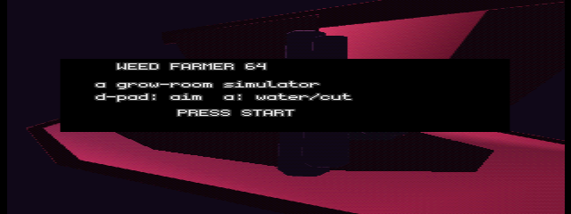
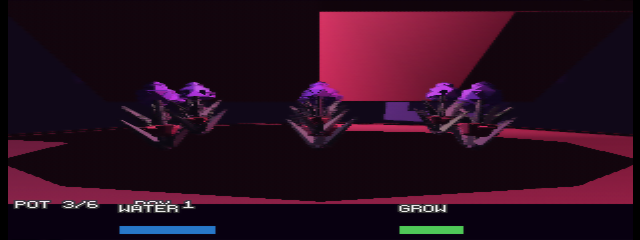
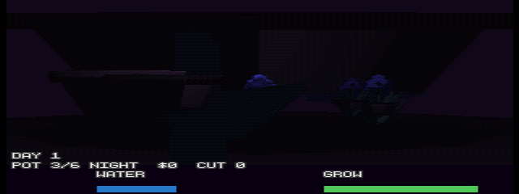
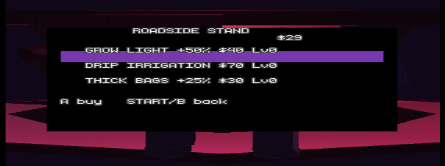
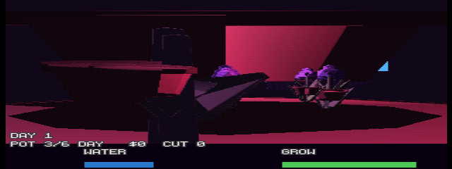

# Weed Farmer 64 🌱

A grow-room farming game for the Nintendo 64, built on
[tiny3d](https://github.com/HailToDodongo/tiny3d) — a from-scratch 3D RSP
microcode and C API on top of [libdragon](https://github.com/DragonMinded/libdragon)
`preview`.


## Screenshots

Title — orbit camera circling the grow room, blinking PRESS START:



The grow room: six procedural low-poly plants under purple grow lights,
rendered through the software RDP (angrylion) at 320×240 in ares:



Night phase — growth pauses, lights swap to cool moonlight:



The roadside stand — three upgrades, funded by your harvests:



Watering burst (tinyPX particles, fixed to true brightness):



## Gameplay demo

42 s of real gameplay, captured headless through angrylion with game audio:
water, growth, night cycle, harvest payouts, and a roadside-stand shopping
trip. Rendered 1:1 from emulated VI output — no scaling cheat.

[**wf64-demo.mp4**](https://github.com/hermespertti/weed-farmer-64/releases/download/v0-slice1/wf64-demo.mp4)
(capture harness: `test/demo.js`)

## How it plays

- **D-pad / stick** — aim at one of six pots (camera pans with the stick)
- **A** — water a thirsty plant, or cut it when ripe
- **Start** — open/close the roadside stand
- **B** — back out of the shop

Plants grow during the 40 s light phase and pause at night. Cutting a ripe
bud pays out by **water quality**: keep a plant well-watered the whole grow
and it sells for up to ~$50 instead of ~$25. Sink the cash at the stand:

| Upgrade | Cost | Levels | Effect |
|---|---|---|---|
| Grow Light +50% | $40 | 3 | Growth speed |
| Drip Irrigation | $70 | 2 | Water drains 35%/lvl slower |
| Thick Bags +25% | $30 | 3 | Sale price |

Everything saves to **EEPROM** (4 Kbit, debounced writes) — day, money,
upgrade levels and every pot's state survive a power cycle. The title screen
shows `CONTINUE d=N $M` when a save is present.

## Build variants

```sh
export N64_INST=/path/to/t3d-sdk N64_GCCPREFIX=/usr
make                                # stable ROM (ships as wf64-latest.z64)
make EXTRA_CFLAGS="-DPARTICLES"     # + tinyPX particle fx (wf64-particles.z64)
make EXTRA_CFLAGS="-DAUDIO_ON"      # + wav64 SFX (water/harvest/thirst nag)
make EXTRA_CFLAGS="-DAUTOTEST"      # headless soak: synthesized inputs + telemetry
```

Requires libdragon `preview` installed to `$N64_INST` plus tiny3d built
against it (`t3d.mk` in the prefix).

## Verification

`test/shot*.js` drive the [headless ares fork](https://github.com/HailToDodongo/ares-64)
(`ares-test`): deterministic boots, screenshots, and a full AUTOTEST soak
synthesizing a player — water → ripen → harvest → buy. The soak log must
contain the `[at] synth active` marker before any "0 exceptions" verdict
counts (a frozen-and-green run is a lie; it happened).

Stable ROM: 2500+ frame soaks, zero exceptions, economy verified
(`$0 → $118`, 5 cuts, 3 upgrades bought).

## Known open items (need real hardware)

- **Particles/audio on iron.** In headless ares, tinyPX (and especially
  tinyPX + audio) dies with `Coprocessor Unusable COP2` at a random frame
  between ~180 and ~2500 — non-deterministic, same ROM. tiny3d's own example
  18 (2000 particles) runs clean in the same harness, so this is either an
  emulator bug in the task-preempt path or an overlay-budget race unique to
  this build. `wf64-particles.z64` is on the releases page for a flash-cart
  A/B: if it runs on hardware, ship particles default-on.
- **EEPROM persistence across reboots.** Verified in-ROM (write + magic/CRC
  load path); ares-test never writes save files on unload and mupen's test
  mode wrote none, so the power-cycle proof is hardware-only.

## Gotchas learned (N64 homebrew, the sharp edges)

- `--ignore-materials` in the glTF importer emits dummy materials **lacking
  `T3D_FLAG_SHADED`** — the RSP skips lighting and everything renders black.
  Fix: force `renderFlags |= T3D_FLAG_SHADED` + `RDPQ_COMBINER_SHADE` at load.
- The exporter needs a material on every mesh, or the importer silently emits
  an empty model.
- Multi-object draws need one `t3d_matrix_push_pos(1)` / `t3d_matrix_pop(1)`
  around the loop, or transforms accumulate and objects fly to infinity.
- **`rdpq_text_printf` silently switches the RDP pipeline to TEXT mode.** Any
  `rdpq_fill_rectangle` after it renders through the text combiner and
  vanishes. Re-arm `rdpq_set_mode_standard() + RDPQ_COMBINER_FLAT` before
  every fill. (Bit my shop selection bar.)
- **The tinyPX combiner is `(PRIM,0,ENV,0)` = color × ENV register.** If you
  never call `rdpq_set_env_color`, particles render at ~20% brightness as
  invisible murk. Pixel-diff tpx-on vs tpx-off to catch this bug class.
- tinyPX particle `size` is an **int8** field: 150 wraps negative and the
  quad disappears. Max usable ≈ 127.
- Particle matrix + draw buffer must be `malloc_uncached` — cached statics fed
  to RSP DMA crash at random frames.
- `rdpq_text_printf` treats `$` as font markup: write `$$` for a dollar sign
  or `rdpq_paragraph_build` asserts mid-frame.
- libdragon `mixer_ch` asserts on sample rate: `audio_init()` rate must match
  your wav64 files (22050 wavs need ≥22050).
- `eeprom_read` returns void; `eeprom_write` returns a **stale** status byte
  (writes are async/cached). Don't gate on it — prove integrity by magic+CRC
  surviving the next boot. Blob I/O: `eeprom_write_bytes`, struct size a
  multiple of 8. Savetype via `N64_ROM_SAVETYPE = eeprom4k` (ed64romconfig
  stamps the header).
- `make clean` deletes `*.z64` — copy release artifacts *before* the next
  clean build, or your release pair is one ROM short.
- `grep -c` exits 1 on a zero count (success) — never chain `&& cp` on it.
- A `-Werror` failure inside a pipelined build (`| grep -c error`) can
  silently leave the *previous* ROM in place for A/B captures. Read the
  actual build output.

## Release

Playable ROMs (stable + particles A/B) on the
[releases page](../../releases).
